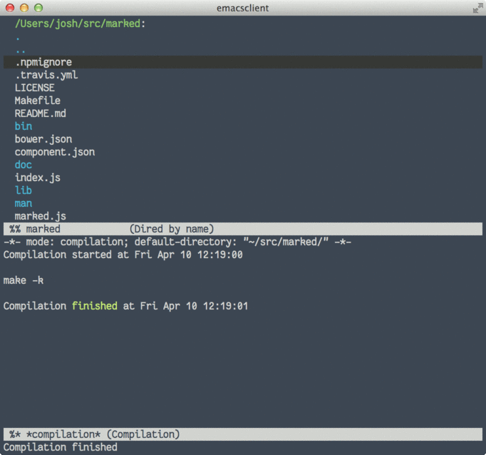
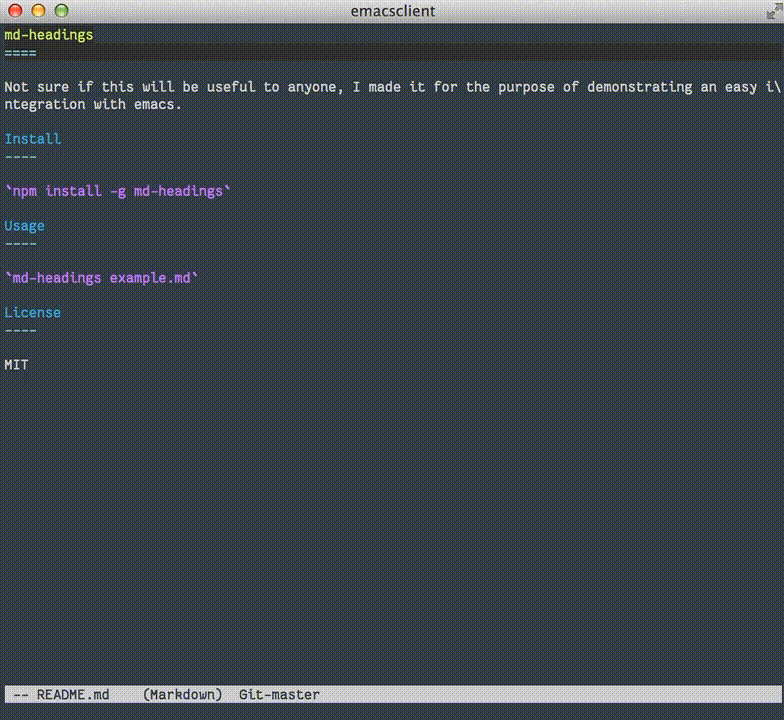

Fun with emacs M-x compile
====

Most software these days is "customizable". You can imagine what the user story looks like:


_Photo source:_ <http://pixelperfectdigital.com/samples/ODY1YzczNWFhODVlMw==/NDVjNzM1YWE4NWUz/photo.jpg>

This is all well and good for your average user. But as a programmer I appreciate tools that are programmable. That's one of the big things that has kept me on emacs over the years.

There was a time way back when I embraced my destiny as a web developer. Regardless of how limited the web platform seeemd compared to native applications, there was something whispering softly to the creative place in my heart. When I saw how to open up a console and edit the code on the page as it ran, I was hooked - this was my "View Source" moment. Looking back, my enjoyment of using emacs stems from a similar place.

Now before going further, a disclaimer: I am not by any stretch a master emacs user or lisper. I don't gpg-encrypt my emails, and I sometimes (regrettably) use non-free software. However I know enough emacs to get by, and what I hope to show is that even this small amount has led to a very satisfying experience of what a text editor can be.

Running shell commands
----

There are several ways to run shell commands in emacs, but one I use all the time is the `compile` function (with `M-x compile`). Traditionally this was used for things like running `make` on your project but it's more versatile than that. As we'll see, it's really just a way of executing a shell command and then formatting the output in a useful way.



Example: navigating a markdown file
----

As an example I whipped up this module to locate all headings in a markdown file: <https://www.npmjs.com/package/md-headings>

After installing and running the command you'll see output like this:

```
> npm install -g md-headings
...

> md-headings README.md

# Main Heading
README.md:1:1

## This one is a subheading
README.md:8:1

## And so on
README.md:20:1
```

Notice how each heading is followed by `FILE:LINE:COLUMN`? The nice thing about this is that `compile` will linkify these to allow you to jump to that position of the file.

So after running `M-x compile` and entering `md-headings README.md` we can navigate the links with `TAB` and Enter, or use `M-x next-error` and `M-x previous-error` to jump to any heading in the file. For convenience (and to save my fingers) I also use a "shortcut mode" that binds these functions to the `.` and `,` keys.



Other uses
----

I use `compile` for a lot of different things, like running tests and triggering build scripts. A handy tip I learned at the [Mastering Emacs](http://www.masteringemacs.org/article/compiling-running-scripts-emacs) site, among other things, is that pressing `g` in the compilation buffer will re-run the command.

Also if you have a script outputs file references in a format other than `FILE:LINE:COLUMN` you can add a custom regexp to the `compilation-error-regexp-alist-alist` variable.

All said and done, I'm certain someone cleverer than me will be able to rewrite everything I've shown you here in emacs-lisp and bundle it into a neat package. Going through that experience would no doubt increment your emacs-wizard level as well. But I find using the built in features of the compilation buffer a sweet-spot for being able to introduce a lot of new functionality without having to spend much time setting it up.

Have a favourite emacs tip of your own? Twitter it at me: [@joshwnj](https://twitter.com/joshwnj)
